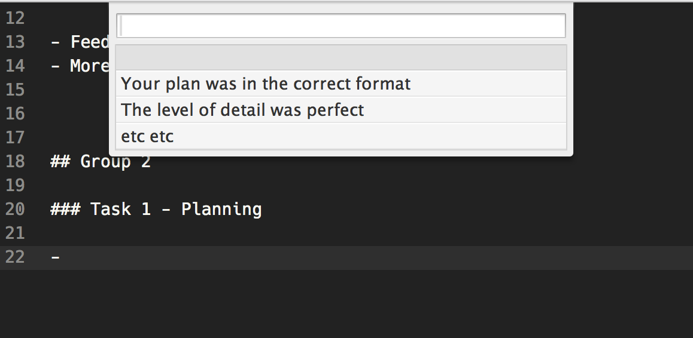

# Feedwhack

A Sublime Text plugin to help writing feedback for student submission.

This is helpful in the unlikely circumstances that you write feedback in the same way as me:

```markdown

# Assignment 

## Group 1

### Task 1 - Planning

- Your plan was in the correct format
- The level of detail was perfect
- etc etc

### Task 2 - Testing

- Feedback for testing blah blah
- More useful insights la la la
```

## Features

While adding feedback pressing <kbd>⌥</kbd> <kbd>^</kbd> <kbd>/</kbd> provides a lit of all of the feedback given to other groups for that section.

If I was writing feedback for Group 2 and was in a `### Task 1 - Planning` section I would see the following: 
